<p align="center">
  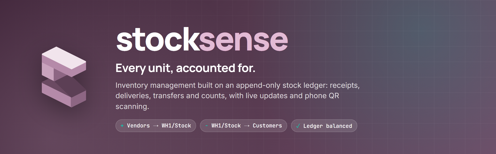
</p>

<p align="center">
  
  
  
  
  
  
</p>

<p align="center">
  <a href="#-features"><b>Features</b></a> ·
  <a href="#-screenshots"><b>Screenshots</b></a> ·
  <a href="#-quick-start"><b>Quick start</b></a> ·
  <a href="#-how-it-works"><b>How it works</b></a> ·
  <a href="#-api"><b>API</b></a> ·
  <a href="#-testing"><b>Testing</b></a>
</p>

<br>

**StockSense** is a full-stack inventory management system for multi-warehouse operations. Receipts,
deliveries, internal transfers and stock counts all flow through **one append-only ledger**, so current stock
is always the sum of its history, and you can prove it with a single click.

<p align="center">
  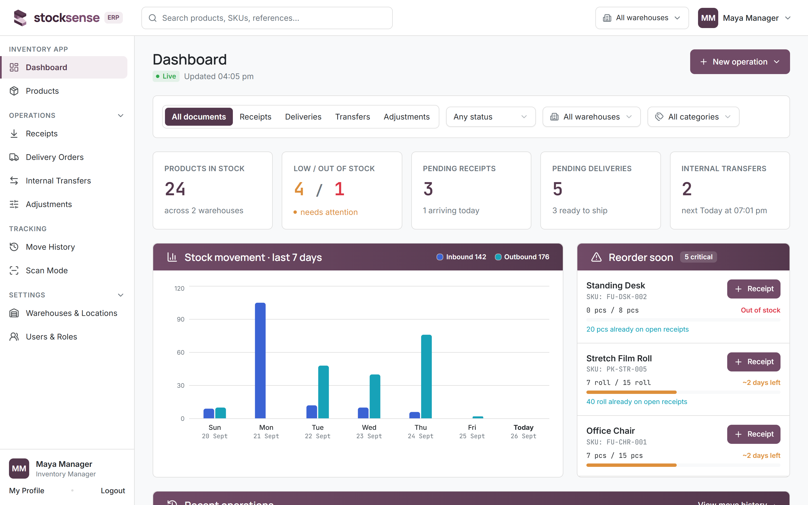
</p>

## ✨ Features

<table>
  <tr>
    <td width="33%" valign="top">
      <h3>📒 Append-only ledger</h3>
      Every change is a <b>move</b> between two locations. Moves are never edited or deleted (a database
      trigger enforces it), and a one-click <b>integrity check</b> recomputes all stock from raw history.
    </td>
    <td width="33%" valign="top">
      <h3>🔄 One workflow for everything</h3>
      Receipts, deliveries and transfers share one lifecycle: <b>Draft → Waiting → Ready → Done</b>, with
      table and <b>drag-and-drop Kanban</b> views, partial quantities and <b>backorders</b>.
    </td>
    <td width="33%" valign="top">
      <h3>📱 Scan Mode</h3>
      Point a phone at a product's QR label to see stock by location, then <b>Receive, Deliver, Move or
      Count</b> in one tap. It validates straight into the ledger.
    </td>
  </tr>
  <tr>
    <td valign="top">
      <h3>⚡ Live everywhere</h3>
      Socket.io pushes every change to every open screen. A waiting delivery flips to <b>Ready</b> on its
      own the moment stock arrives.
    </td>
    <td valign="top">
      <h3>📈 Decisions, not just data</h3>
      KPI cards, a 7-day movement chart, and a <b>reorder panel</b> that shows "~N days left" from real
      outflow, with one-click draft purchase receipts.
    </td>
    <td valign="top">
      <h3>🛡️ Safe by construction</h3>
      Row-locked transactions, no negative stock (DB <code>CHECK</code>), bcrypt-hashed secrets, OTP
      password reset, role-based access and <b>user management</b>.
    </td>
  </tr>
</table>

## 📸 Screenshots

<table>
  <tr>
    <td width="50%">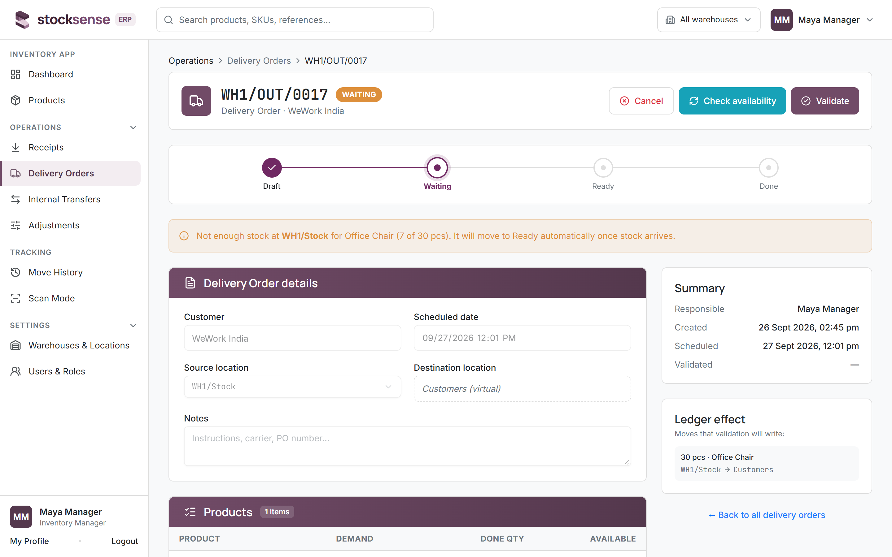<p align="center"><sub><b>Documents</b>: status pipeline, live availability, ledger preview</sub></p></td>
    <td width="50%">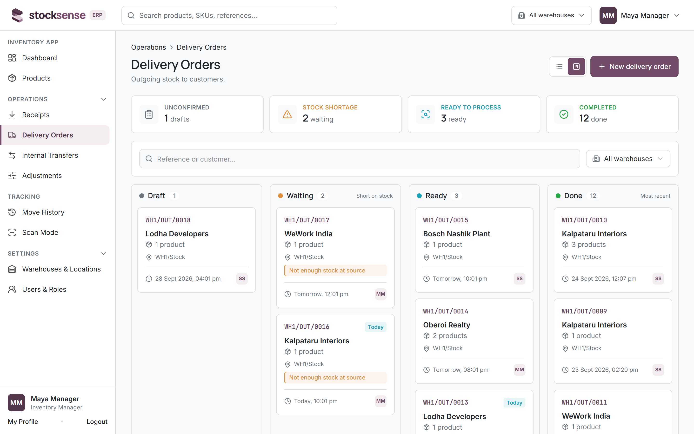<p align="center"><sub><b>Kanban</b>: drag Draft → Ready to confirm, Ready → Done to validate</sub></p></td>
  </tr>
  <tr>
    <td>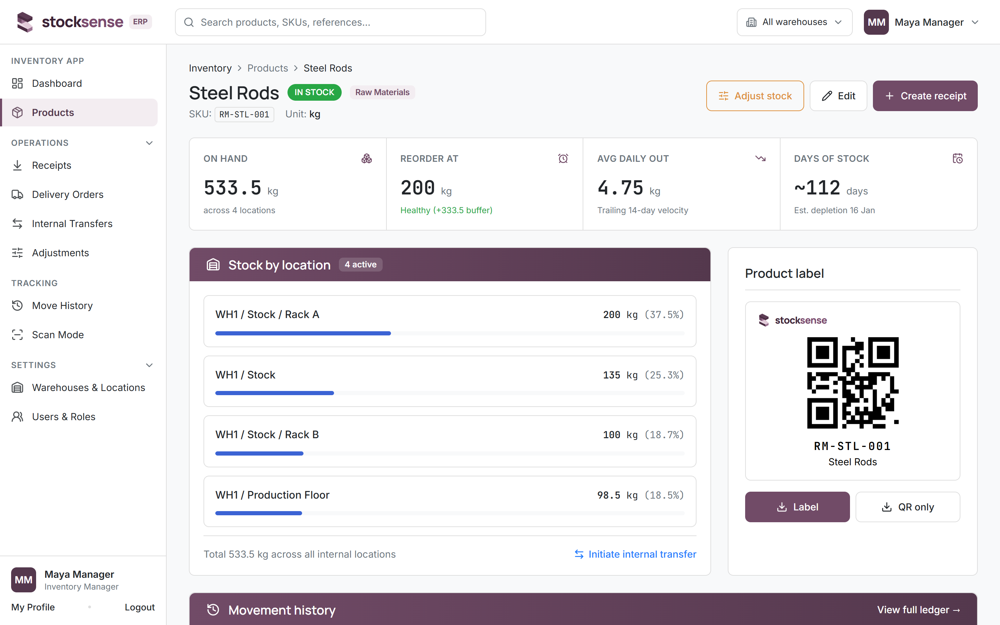<p align="center"><sub><b>Product</b>: stock by location, days of stock, printable QR label</sub></p></td>
    <td>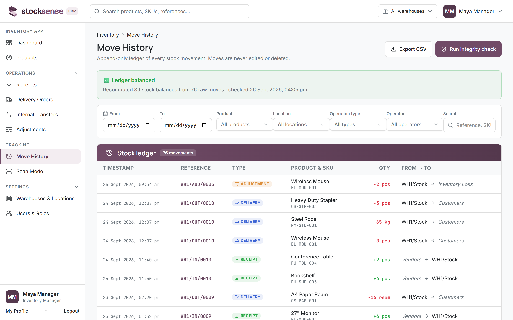<p align="center"><sub><b>Move History</b>: the ledger, with a one-click integrity check</sub></p></td>
  </tr>
  <tr>
    <td>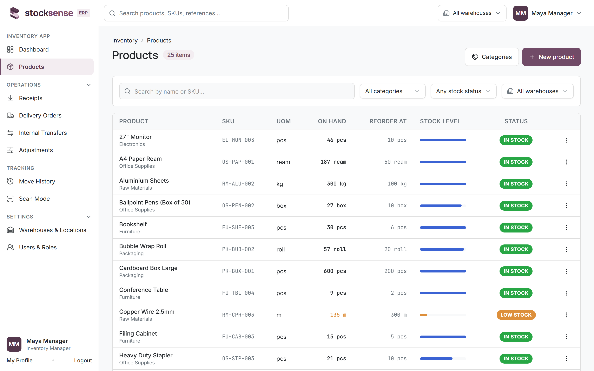<p align="center"><sub><b>Products</b>: search, filters and stock status at a glance</sub></p></td>
    <td>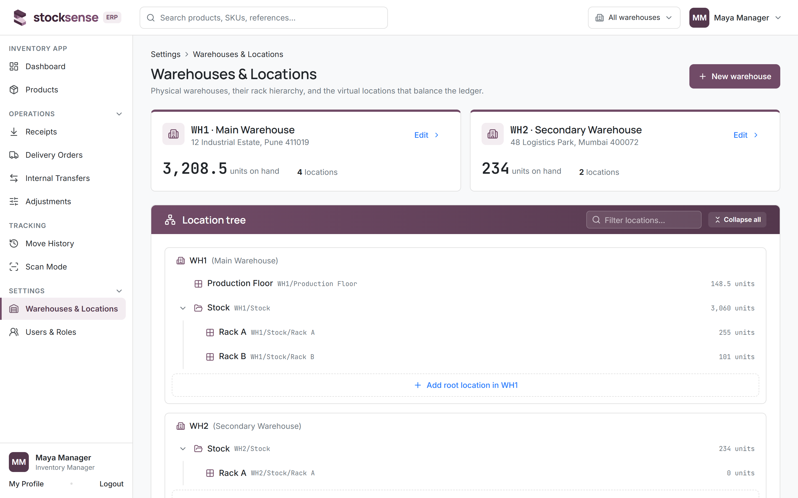<p align="center"><sub><b>Warehouses</b>: location tree and virtual locations</sub></p></td>
  </tr>
</table>

<table>
  <tr>
    <td width="68%">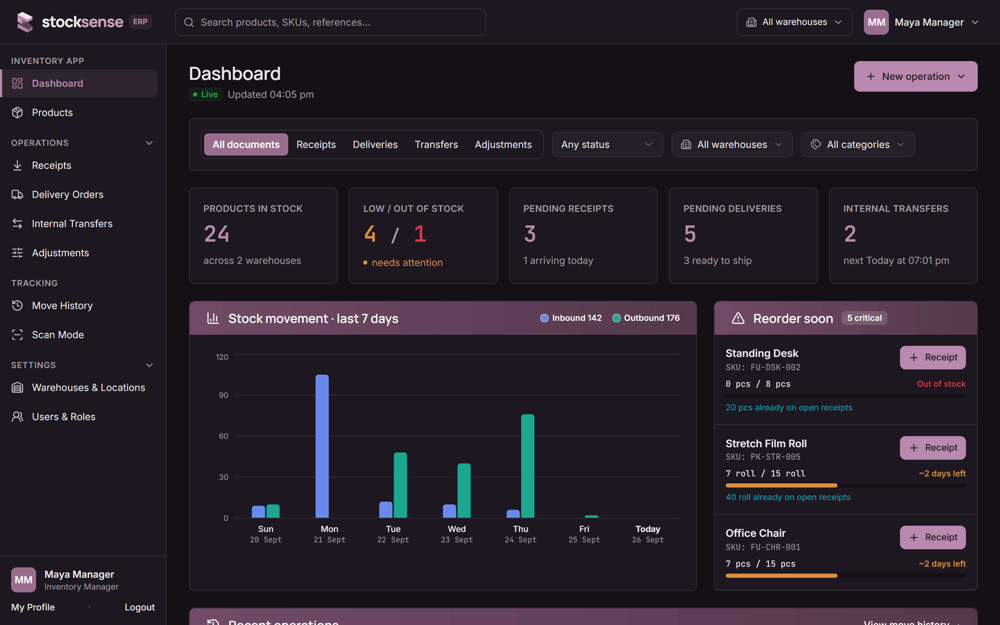<p align="center"><sub><b>Dark mode</b>, with its own validated colour palette</sub></p></td>
    <td width="32%">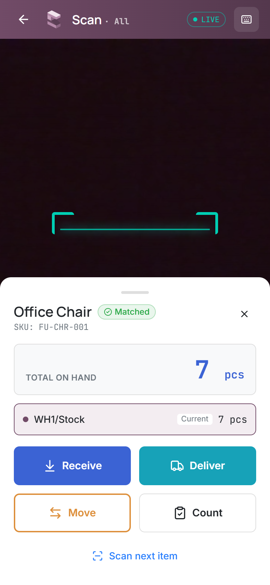<p align="center"><sub><b>Scan Mode</b> on a phone</sub></p></td>
  </tr>
</table>

## 🚀 Quick start

> **Requirements:** Node.js 20+ and PostgreSQL. No Postgres installed? Use the built-in embedded one (below).

```bash
git clone https://github.com/sahiladdagatla/stocksense-odoo.git
cd stocksense-odoo
npm install
cp server/.env.example server/.env
cp client/.env.example client/.env
```

Start a database, **either** zero-install or with Docker:

```bash
npm run db:start      # embedded PostgreSQL, keep this terminal open
# or
npm run db:up         # PostgreSQL 17 via docker-compose
```

Then, in a new terminal:

```bash
npm run db:migrate    # tables, constraints and the ledger trigger
npm run seed          # demo data: 25 products, 47 operations over 14 days
npm run dev           # API on :4000 · app on http://localhost:5173
```

### 🔑 Demo accounts

| Role        | Email                    | Password      | Can do                                                       |
| ----------- | ------------------------ | ------------- | ------------------------------------------------------------ |
| **Manager** | `manager@stocksense.dev` | `Manager@123` | Everything, including products, warehouses and users         |
| **Staff**   | `staff@stocksense.dev`   | `Staff@123`   | View everything, run receipts, deliveries, transfers, counts |

The login page has one-click buttons for both.

<details>
<summary><b>📱 Using Scan Mode on a real phone</b></summary>

<br>

Phones only allow camera access over HTTPS, so run:

```bash
npm run dev:https
```

Open the **Network** URL that Vite prints (for example `https://192.168.x.x:5173`) on a phone on the same Wi-Fi,
accept the self-signed certificate, and open **Scan Mode**. Print or display a label from any product page
(**Label** button) and point the camera at it. No camera? Tap the keyboard icon and type the SKU.

</details>

<details>
<summary><b>✉️ Password reset without an email server</b></summary>

<br>

Password reset sends a 6-digit code. If `SMTP_HOST` is empty in `server/.env`, the code is printed in the
**server console**, so the flow works in any demo. Codes expire after 10 minutes, work once, and lock after
5 wrong attempts.

</details>

## 🧠 How it works

### Everything is a stock move

The outside world is modelled as **virtual locations**, so every operation, whatever its type, is simply
_"move X units from A to B"_:

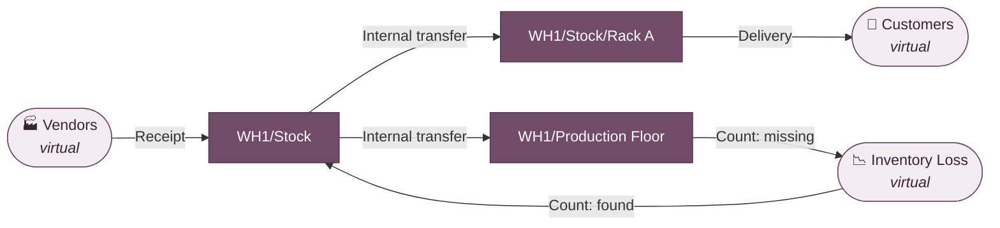

| Operation  | Source → Destination                                                       |
| ---------- | -------------------------------------------------------------------------- |
| Receipt    | `Vendors` (virtual) → internal location                                    |
| Delivery   | internal location → `Customers` (virtual)                                  |
| Transfer   | internal location → internal location                                      |
| Adjustment | internal location ↔ `Inventory Loss` (virtual), the sign decides direction |

Two tables do the work:

- **`StockMove`** is the ledger: product, from, to, quantity, who, when. **Append-only**: a PostgreSQL trigger
  rejects any `UPDATE` or `DELETE`. Mistakes are corrected with a new, counter-balancing move.
- **`StockQuant`** is on-hand stock per product and internal location: a fast summary, written **only** in the
  same transaction as the moves. Virtual locations never hold quants and never run out.

### The stock engine

One function, `validateOperation()` in [`server/src/services/stock.service.ts`](server/src/services/stock.service.ts),
validates every operation type:

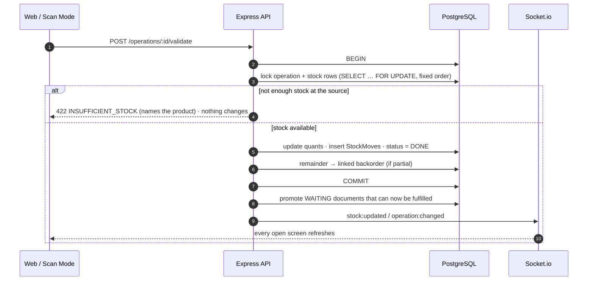

**Guarantees**, enforced by the database, not just the code:

- 🔒 **No oversell under concurrency:** row locks serialise competing validations, and a test fires two at once.
- 🚫 **No negative stock:** `CHECK (quantity >= 0)` on every quant.
- 📜 **History can't be rewritten:** the ledger trigger blocks edits and deletes.
- 🔢 **No duplicate references:** `WH1/IN/0001`-style numbers come from an atomic sequence.
- ✅ **Provably balanced:** `GET /moves/integrity-check` recomputes every balance from raw moves.

<details>
<summary><b>📁 Project structure</b></summary>

```
server/                     Express + TypeScript + Prisma
├─ prisma/                  schema, migrations, seed (history created through the real services)
├─ src/routes               → controllers → services → Prisma   (business logic lives only in services)
├─ src/schemas              Zod validation for every input
└─ tests/                   Vitest: engine, concurrency, backorders, users, API, end-to-end
client/                     Vite + React 19 + Tailwind 4 + shadcn/ui
├─ src/pages                screens (one shared list + one shared form drive every operation type)
└─ src/components           design system: DataTable, StatusStepper, KanbanBoard, Logo, …
design/                     design system (DESIGN.md), logo files, screen references
docs/                       README images
```

</details>

## 🔌 API

All endpoints live under `/api` and need `Authorization: Bearer <token>`, except the auth routes. Errors are
always `{ "error": { "code", "message" } }`. **Staff** can read everything and run operations; changing
products, categories, warehouses, locations or users needs **Manager** (`403` otherwise).

<details>
<summary><b>Endpoint reference</b></summary>

<br>

| Area        | Endpoints                                                                                                                                                                                                                                                                          |
| ----------- | ---------------------------------------------------------------------------------------------------------------------------------------------------------------------------------------------------------------------------------------------------------------------------------- |
| Auth        | `POST /auth/signup` · `POST /auth/login` · `POST /auth/forgot-password` · `POST /auth/reset-password` · `GET/PATCH /auth/me` · `GET /auth/me/stats`                                                                                                                                |
| Users       | `GET /users` · `PATCH /users/:id` (Manager: change role, deactivate/reactivate; not your own account)                                                                                                                                                                              |
| Warehouses  | `GET/POST /warehouses` · `GET/PATCH/DELETE /warehouses/:id`                                                                                                                                                                                                                        |
| Locations   | `GET/POST /locations` · `GET /locations/tree` · `GET/PATCH/DELETE /locations/:id`                                                                                                                                                                                                  |
| Categories  | `GET/POST /categories` · `PATCH/DELETE /categories/:id`                                                                                                                                                                                                                            |
| Products    | `GET /products?search=&categoryId=&warehouseId=&stockStatus=&page=` · `POST /products` · `GET/PATCH/DELETE /products/:id` · `GET /products/:id/stock` · `GET /products/sku/:sku`                                                                                                   |
| Operations  | `GET /operations?type=&status=&warehouseId=&categoryId=&search=&page=` · `GET /operations/counts` · `POST /operations` · `GET/PATCH /operations/:id` · `POST /operations/:id/confirm` · `/validate` (`{ createBackorder?: boolean }`) · `/cancel` · `GET /operations/:id/slip.pdf` |
| Adjustments | `POST /adjustments`                                                                                                                                                                                                                                                                |
| Moves       | `GET /moves?productId=&locationId=&type=&userId=&from=&to=&search=&page=` · `GET /moves/export.csv` · `GET /moves/integrity-check`                                                                                                                                                 |
| Dashboard   | `GET /dashboard/kpis` · `GET /dashboard/movement-chart` · `GET /dashboard/reorder` (all accept `warehouseId`, `categoryId`)                                                                                                                                                        |

Real-time: connect with `io(url, { auth: { token } })` to receive `stock:updated` and `operation:changed`.

</details>

## 🧪 Testing

**89 tests** run against a real PostgreSQL database (a separate `stocksense_test` DB, reset between tests):

| Suite        | What it proves                                                                                                   |
| ------------ | ---------------------------------------------------------------------------------------------------------------- |
| Stock engine | receipts add, deliveries subtract, short deliveries change nothing, transfers keep totals, adjustments both ways |
| Concurrency  | two validations racing for the same stock never oversell; double-validating books once                           |
| Backorders   | partial quantities create linked backorders that wait for, then pick up, new stock                               |
| Edge cases   | bad input, 3-decimal precision, all-or-nothing multi-line documents, deletion protection, search escaping        |
| Auth & users | hashed secrets, OTP reset and lockout, rate limits, roles, deactivated accounts                                  |
| End-to-end   | receive 100 kg → transfer → deliver 20 → adjust −3 → **ledger balanced**                                         |

```bash
npm test          # server test suite
npm run check     # typecheck + lint + format + tests
```

## 🧰 Tech stack

| Layer   | Tools                                                                                                                                                 |
| ------- | ----------------------------------------------------------------------------------------------------------------------------------------------------- |
| Server  | Node 20 · Express 5 · TypeScript · Prisma 6 · PostgreSQL · Zod · bcrypt · JWT · Socket.io · pdfkit · Nodemailer                                       |
| Client  | Vite · React 19 · TypeScript · Tailwind CSS 4 · shadcn/ui · TanStack Query · React Router · react-hook-form · Recharts · Framer Motion · html5-qrcode |
| Quality | Vitest · Supertest · ESLint · Prettier · strict TypeScript everywhere                                                                                 |

<details>
<summary><b>All npm scripts</b></summary>

<br>

| Command                              | What it does                             |
| ------------------------------------ | ---------------------------------------- |
| `npm run dev`                        | API and web app with hot reload          |
| `npm run dev:https`                  | Same, with HTTPS for Scan Mode on phones |
| `npm run db:start` / `npm run db:up` | Embedded PostgreSQL / Docker PostgreSQL  |
| `npm run db:migrate`                 | Apply database migrations                |
| `npm run seed`                       | Reset and load demo data                 |
| `npm test`                           | Run the test suite                       |
| `npm run check`                      | Typecheck, lint, format check and tests  |

</details>

## 👥 Team

<table>
  <tr>
    <td align="center"><a href="https://github.com/sahiladdagatla"><br><sub><b>@sahiladdagatla</b></sub></a></td>
    <td align="center"><a href="https://github.com/gragznotkool"><br><sub><b>@gragznotkool</b></sub></a></td>
  </tr>
</table>

<p align="center">
  <br>
  <sub><b>StockSense</b>: every unit, accounted for.</sub>
</p>
